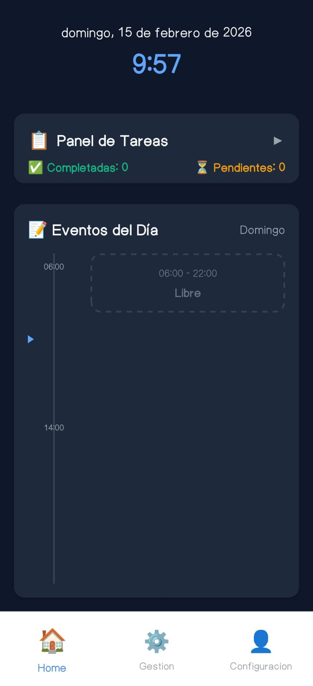
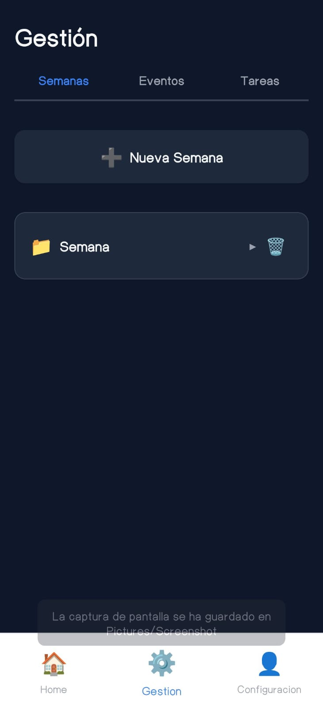
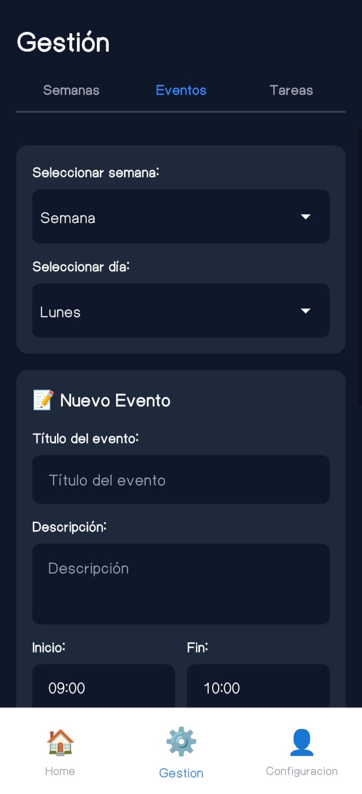
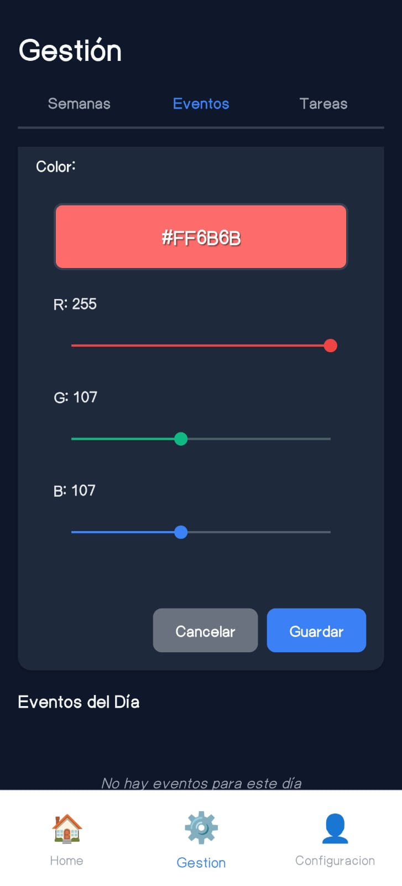
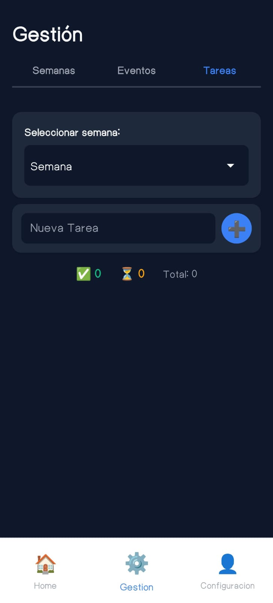

📱 AgendApp — Gestor de Productividad Móvil

AgendApp es una aplicación móvil desarrollada en React Native + TypeScript, enfocada en la gestión eficiente del tiempo, organización semanal, planificación de eventos y control de tareas, todo dentro de una interfaz moderna, fluida y orientada a la productividad.

Este proyecto fue diseñado y construido como un producto funcional real, aplicando buenas prácticas de arquitectura, diseño UI/UX, modularidad y optimización de rendimiento.

🎯 Objetivo del Proyecto

Crear una aplicación móvil robusta, rápida y minimalista que permita al usuario:

Organizar su semana

Visualizar su agenda diaria

Gestionar eventos

Administrar tareas

Mantener su productividad sin depender de conexión a internet

🚀 Funcionalidades Principales

📅 Organización semanal estructurada

📝 Gestión de eventos con horarios y descripciones

⏱ Línea de tiempo visual del día

✅ Sistema de tareas con estados

🎨 Selector de colores para eventos

🌗 Modo claro, oscuro y automático

🌎 Soporte multilenguaje (Español / Inglés)

💾 Persistencia local con SQLite

📱 Navegación fluida con barra inferior

⚡ Optimización de rendimiento

🧠 Arquitectura y Enfoque Técnico

La aplicación implementa una arquitectura modular y escalable, separando claramente:

Interfaz de usuario (UI)

Navegación

Lógica de negocio

Persistencia de datos

Servicios

Principios aplicados:

Arquitectura limpia (Clean Architecture adaptada)

Separación de responsabilidades

Diseño offline-first

Componentes reutilizables

Gestión eficiente del estado

🛠️ Stack Tecnológico

React Native

TypeScript

React Navigation

SQLite

AsyncStorage

Notifee (notificaciones)

ESLint + Prettier

Jest

📸 Capturas de Pantalla

📦 APK de Prueba

El proyecto incluye un APK funcional listo para instalar en Android:

AgendApp.apk

⚙️ Instalación y Ejecución
git clone https://github.com/lveryfast/AgendApp
cd AgendaReact
npm install
npm start
npm run android

📂 Estructura del Proyecto
src/
 ├── components/
 ├── navigation/
 ├── screens/
 ├── services/
 ├── storage/
 └── utils/

📱 Plataforma Soportada

✅ Android

❌ iOS (no implementado)